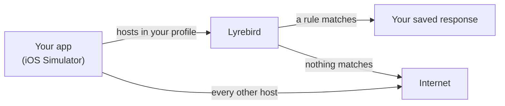
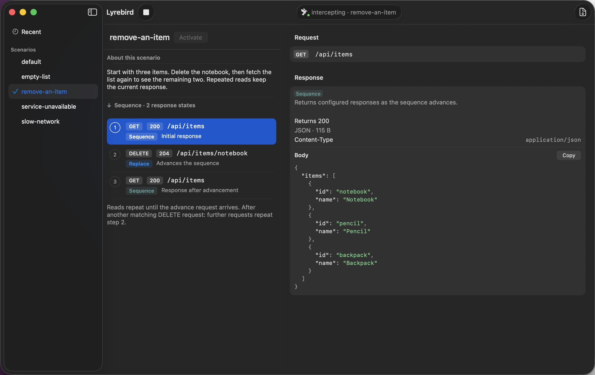

# Lyrebird

Put your iOS app into states your backend can't easily produce — without changing or rebuilding it.

An outage. A slow network. An empty list. A feature flag that isn't switched on yet. Lyrebird
intercepts chosen HTTPS requests from the iOS Simulator and answers them however you like, so those
states become something you can save, share, and get back to in one command.

## A scenario is just a JSON file

This one makes every order request fail:

```json
{
  "name": "orders-outage",
  "overrides": [
    {
      "match": { "method": "GET", "path": "/api/v1/orders/*" },
      "mode": "replace",
      "status": 500,
      "body": { "error": { "code": "INTERNAL_ERROR" } }
    }
  ]
}
```

```bash
bin/lyrebird use orders-outage
```

The next matching `GET /api/v1/orders/…` gets the 500 — `use` changes what comes *after* it,
and relaunches nothing. To have the app's *launch* requests meet a scenario, start the run
with `bin/lyrebird up --use orders-outage`. One scenario is active at a time.

There are two ways to answer a request:

| | |
|---|---|
| **`replace`** | Answer locally with the response you configured. Never touches your backend — so it works offline, off-VPN, or for an endpoint nobody has built yet. |
| **`patch`** | Let the real response come back, then change part of it. Good for flipping one field in a payload you otherwise want intact. |

## Scenarios that move

A backend can produce a state. What it can't produce on demand is a *transition* — delete a row and
have the next refresh show it gone. A rule can hold a list of steps and a trigger that advances them:

```json
{
  "match": { "method": "GET", "path": "/api/v1/items" },
  "mode": "replace",
  "sequence": {
    "advanceOn": { "method": "DELETE", "path": "/api/v1/items/*" },
    "steps": [
      { "body": { "items": ["a", "b", "c"] } },
      { "body": { "items": ["a", "c"] } }
    ]
  }
}
```

Enter the screen — three items. Fetch it again, and again: still three, because the trigger is the
`DELETE`, not the fetch. Delete one, refresh: two. Your screen's own fetch pattern stops mattering,
which is what makes this reliable rather than fiddly.

Leave `advanceOn` out and the steps advance on the rule's own calls instead — the first attempt
fails, the second succeeds, for exercising retry logic. Run past the last step and Lyrebird says so
with a `500` rather than quietly repeating itself.

A `patch` that switches on a feature flag, keeping everything else the server said:

```json
{
  "match": { "method": "GET", "path": "/api/v1/features" },
  "mode": "patch",
  "patchStrategy": "appendToArray",
  "patch": { "features": [ { "id": "BETA_EXPORT", "enabled": true } ] }
}
```

## What it touches

Only the hostnames you list. Everything else on your Mac — your browser, Slack, the rest of the
Simulator — keeps going straight out, untouched and undecrypted.



Requests with no matching rule are passed straight through, so your app keeps working normally
while one endpoint misbehaves.

## Quick start

You need macOS, a booted iOS Simulator, and **Python 3.12 or newer** (mitmproxy 12 requires it).

```bash
git clone https://github.com/pistelak/lyrebird.git && cd lyrebird
git tag -l 'v*'            # the releases; check out the newest, e.g. git checkout v0.1.0

cd engine && python3 -m venv .venv && .venv/bin/pip install --require-hashes -r requirements.txt && cd ..

bin/lyrebird init          # creates ~/.config/lyrebird
```

To call it as `lyrebird` from anywhere, link it onto your PATH:

```bash
mkdir -p "$HOME/.local/bin" && ln -s "$PWD/bin/lyrebird" "$HOME/.local/bin/lyrebird"   # ~/.local/bin must be on PATH
```

**Then edit `~/.config/lyrebird/profile.json` before starting.** What ships is a template, not a
working demo — `api.example.com` doesn't serve any of the example routes:

- set `hosts` to the exact hostname your app calls
- set `simBundleId` to your app's bundle identifier
- point one of the files in `scenarios/` at a request your app actually makes
  (they may sit in one level of folder — `scenarios/checkout/cart-empty.json` is the scenario
  `checkout/cart-empty`)

```bash
bin/lyrebird up --use orders-outage   # CA, host-scoped PAC, the scenario, then your app
bin/lyrebird status

bin/lyrebird down                     # puts your proxy settings back
```

If the proxy is ever killed outright and your network is left pointing at it,
[TROUBLESHOOTING.md](TROUBLESHOOTING.md#the-proxy-is-gone-but-the-network-still-points-at-it) has
the recovery.

`up` relaunches your app if `simBundleId` is set, and `--use` selects the scenario *before* that
launch — which is why they are one command: `URLSession` holds on to the proxy configuration it
saw at launch, and the app's first requests go out while it starts, so a scenario chosen
afterwards is one the launch never saw. `up --use` refuses to launch anything if the scenario does
not exist or did not load whole, and exits non-zero with the proxy left running for you to
`down`. If `simBundleId` isn't set, relaunch the app yourself; if something else owns the launch —
a UI-test runner — pass `--no-relaunch` and start it once `up` has exited 0.

To review prepared scenarios visually, use the optional [macOS scenario browser](#macos-app).

## Driving it from an agent

Much of Lyrebird's use is a coding agent putting an app into a backend state, checking
something, and putting the machine back. The commands are built for that: exit codes mean the
postcondition was met rather than "the command ran", `status --json` is machine-readable, and
`wait-ready --match` blocks until a rule actually fires instead of sleeping and hoping.

```bash
lyrebird up --use orders-outage            # the scenario is live before the app is relaunched
lyrebird wait-ready --match --timeout 30   # ✓ override ovr_9a99bd matched GET /api/v1/orders/42 → 500
lyrebird down
```

[AGENTS.md](AGENTS.md) is the full contract — the loop, the control API, and the mistakes that
cost the most time.

## macOS app

The optional macOS app requires **macOS 26 or newer** and is a companion for browsing scenarios
your coding agent has prepared. Building it requires Xcode 26 or newer with the macOS 26 SDK.
Its menu-bar controls manage interception; the scenario browser lets you inspect what each
scenario will do before trying it. Open
**Scenarios** from the menu bar to explore the saved requests, responses, and sequence transitions.
Scenario notes explain the intended test case; the detail pane shows the matching conditions and
configured response body.

A single click browses a scenario. Double-clicking activates it when you are ready to try it in
your iOS app. **Recent** shows the requests recorded during the run and which rules answered them.



*In this synthetic example, GET returns three items. DELETE advances the sequence, and subsequent
GETs return the remaining two.*


*Scenarios that live in a folder appear under it. A rule can replace a response outright, patch the
real one, or step through a sequence — the detail pane says which, and what it answers with.*

See the [macOS app guide](menubar/README.md) for installation, menu-bar controls, and configuration.

## Profiles

Your hosts and scenarios live in a **profile** directory, outside this repo. The default is
`~/.config/lyrebird`; use another with `bin/lyrebird --profile /path/to/profile up`.

Because a profile is plain JSON, you can keep it in its own repository and review scenarios the way
you review code. Saving a scenario writes to it — that is what it is for. Everything *operational*
stays out, in the macOS directory that matches how long it should live: the active-scenario pointer
and the CA under `~/Library/Application Support/Lyrebird/`, the proxy log under
`~/Library/Logs/Lyrebird/`. So a profile in git changes when you change a scenario, never merely
because the proxy ran.

Where a profile sits has two consequences worth knowing before you move one: saving a scenario
requires its file to resolve inside the profile, and the remembered active scenario is keyed by the
profile's resolved path. [engine/README.md](engine/README.md#profiles) has both.

## Upgrading

Releases are tags, so upgrading is a checkout, not a `git pull`. Dependencies are hash-locked,
which means the virtualenv is recreated rather than upgraded in place. From the checkout root:

```bash
lyrebird down &&                          # before the checkout, not after
  git fetch --tags &&
  git tag -l 'v*'                         # pick the one you want
git checkout v0.2.0 &&
  cd engine &&
  python3 -m venv --clear .venv &&
  .venv/bin/pip install --require-hashes -r requirements.txt &&
  cd ..
```

Name the tag rather than deriving it: you are standing on the last release, so anything that asks
git to describe where you are will hand back the version you already have. Rolling back is the same
with an earlier tag.

The steps are chained because each one only makes sense if the last worked — a checkout that failed
leaves the old tree, and reinstalling into it would look like an upgrade that happened. `down` comes
first because swapping dependencies under a running engine leaves a mixed runtime that neither
version was tested as. Rebuild the menu-bar app afterwards if you use it.

If you skipped the `PATH` symlink, `bin/lyrebird down` from the checkout root does the same.

## Uninstalling

Order matters — the first step is the one that gives you your network back:

```bash
lyrebird down && rm "$HOME/.local/bin/lyrebird"    # and lb, if you linked it
```

Chained on purpose: if `down` cannot restore your proxy settings it exits non-zero, and that is the
moment to stop rather than to delete the command that fixes it. If it does fail,
[TROUBLESHOOTING.md](TROUBLESHOOTING.md#the-proxy-is-gone-but-the-network-still-points-at-it) has
the manual recovery — do that first, then come back.

Then delete the checkout, and the app from `/Applications` if you built and copied it. **Quitting
the menu-bar app does not stop interception** — the engine runs detached from it, and `down` is
what puts your proxy settings back.

Operational state is separate, and optional to remove: the active-scenario pointer and the CA under
`~/Library/Application Support/Lyrebird/`, logs under `~/Library/Logs/Lyrebird/`.

Two things deliberately survive. **Your profile** (`~/.config/lyrebird` by default) holds the
scenarios you wrote — nothing above touches it. And **the CA stays trusted in the simulator**:
`simctl` cannot remove one root certificate, so `xcrun simctl keychain <udid> reset` is the tool,
and it clears *every* certificate you have added to that device, not only Lyrebird's. Erasing the
device does the same. [SECURITY.md](SECURITY.md) has the detail.

## Where it fits

Proxyman and Charles are better for exploring traffic interactively. Raw mitmproxy scripting is
better when you want unrestricted control. Lyrebird covers the narrow bit in between: scenarios
saved as files, switched in one command, shared with your team.

It changes responses. It is not an API server, a network debugger, or a substitute for contract
tests.

### Not the other Lyrebird

[Meituan's Lyrebird](https://github.com/Meituan-Dianping/lyrebird) is an older, larger and
unrelated project with the same name — a plugin-based testing platform for mobile apps, and the one
`pip install lyrebird` gives you. Both are named after the bird. If that is the one you wanted, it
is over there.

Three differences, if you are choosing between them: this one decrypts only the hostnames you list
instead of proxying the whole device, never records response bodies, and treats being driven by a
coding agent as the main case rather than an API bolted to a UI.

## Security

Lyrebird decrypts TLS for the hostnames in your profile. That's the point, and it's worth knowing
exactly what it does:

- It creates **its own CA** and trusts it in **one Simulator only** — the booted one, or the one
  you name with `--simulator`; never your system keychain, never your other browsers.
- Only your exact hostnames are decrypted. `api.example.com` doesn't imply `sub.api.example.com`.
- Response bodies are **never recorded**. Recent traffic keeps time, method, host, path, status
  and which override matched — never a request or response body.
- The control API is unauthenticated on loopback, with Host and Origin checks so a web page
  you're visiting can't drive it. Other processes running as you still can.
- `down` restores the proxy settings you had before.

Development machines only. [SECURITY.md](SECURITY.md) has the full threat model and how to remove
the CA.

## More

`bin/lyrebird` has `init`, `up`, `down`, `status`, `use`, `recent`, `validate`, `explain-match`,
`reset`, `assert-answered`, `wait-ready`, `sequence`, `override`, `scenario`, `relaunch`,
`trust-ca`, `untrust-ca` and `logs`. `bin/lb` is a shorter alias for it.

- [Engine guide](engine/README.md) — the full rule schema, matching order, control API, ports, tests
- [macOS scenario browser](menubar/README.md) — inspect scenarios prepared by your agent; build and install the optional app
- [AGENTS.md](AGENTS.md) — driving Lyrebird from a coding agent
- [Troubleshooting](TROUBLESHOOTING.md) — symptoms, their usual causes, and reading the proxy log
- [Contributing](CONTRIBUTING.md)

## Licence

[MIT](LICENSE). Named after the bird that can imitate any sound it hears.
