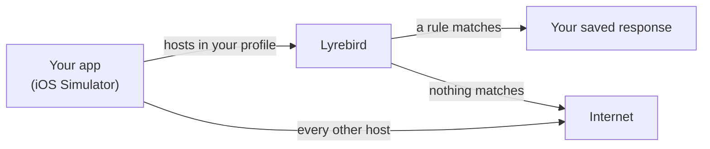

# Lyrebird

Put your iOS app into states your backend can't easily produce — without changing or rebuilding it.

An outage. A slow network. An empty list. A feature flag that isn't switched on yet. Lyrebird
intercepts chosen HTTPS requests from the iOS Simulator and answers them however you like, so those
states become something you can save, share, and get back to in one command.

## A scenario is just a JSON file

This one makes every order request fail:

```json
{
  "name": "orders-outage",
  "overrides": [
    {
      "match": { "method": "GET", "path": "/api/v1/orders/*" },
      "mode": "replace",
      "status": 500,
      "body": { "error": { "code": "INTERNAL_ERROR" } }
    }
  ]
}
```

```bash
bin/lyrebird use orders-outage
```

The next matching `GET /api/v1/orders/…` gets the 500. Switch sessions to switch scenarios.

There are two ways to answer a request:

| | |
|---|---|
| **`replace`** | Answer locally with the response you configured. Never touches your backend — so it works offline, off-VPN, or for an endpoint nobody has built yet. |
| **`patch`** | Let the real response come back, then change part of it. Good for flipping one field in a payload you otherwise want intact. |

A `patch` that switches on a feature flag, keeping everything else the server said:

```json
{
  "match": { "method": "GET", "path": "/api/v1/features" },
  "mode": "patch",
  "patchStrategy": "appendToArray",
  "patch": { "features": [ { "id": "BETA_EXPORT", "enabled": true } ] }
}
```

## What it touches

Only the hostnames you list. Everything else on your Mac — your browser, Slack, the rest of the
Simulator — keeps going straight out, untouched and undecrypted.



Requests with no matching rule are passed straight through, so your app keeps working normally
while one endpoint misbehaves.

## Quick start

You need macOS, a booted iOS Simulator, and **Python 3.12 or newer** (mitmproxy 12 requires it).

```bash
cd engine && python3 -m venv .venv && .venv/bin/pip install -r requirements.txt && cd ..

bin/lyrebird init          # creates ~/.config/lyrebird
```

**Then edit `~/.config/lyrebird/profile.json` before starting.** What ships is a template, not a
working demo — `api.example.com` doesn't serve any of the example routes:

- set `hosts` to the exact hostname your app calls
- set `simBundleId` to your app's bundle identifier
- point one of the files in `sessions/` at a request your app actually makes

```bash
bin/lyrebird up            # trusts a CA in the Simulator, routes your hosts through Lyrebird
bin/lyrebird use orders-outage
bin/lyrebird status

bin/lyrebird down          # puts your proxy settings back
```

`up` relaunches your app if `simBundleId` is set. If it isn't, relaunch it yourself — `URLSession`
holds on to the proxy configuration it saw at launch, so a running app won't notice Lyrebird.

There's a dashboard at <http://127.0.0.1:8088/> and an optional
[menu-bar app](menubar/README.md).

## Driving it from an agent

Much of Lyrebird's use is a coding agent putting an app into a backend state, checking
something, and putting the machine back. The commands are built for that: exit codes mean the
postcondition was met rather than "the command ran", `status --json` is machine-readable, and
`wait-ready --match` blocks until a rule actually fires instead of sleeping and hoping.

```bash
lyrebird up && lyrebird use orders-outage
lyrebird wait-ready --match --timeout 30   # ✓ override ovr_9a99bd matched GET /api/v1/orders/42 → 500
lyrebird down
```

[AGENTS.md](AGENTS.md) is the full contract — the loop, the control API, and the mistakes that
cost the most time.

## Profiles

Your hosts, sessions and presets live in a **profile** directory, outside this repo. The default is
`~/.config/lyrebird`; use another with `bin/lyrebird --profile /path/to/profile up`.

Because a profile is plain JSON, you can keep it in its own repository and review scenarios the way
you review code. Saving a scenario writes to it — that is what it is for. Everything *operational*
stays out, in the macOS directory that matches how long it should live: the active-session pointer
and the CA under `~/Library/Application Support/Lyrebird/`, the generated catalog under
`~/Library/Caches/com.lyrebird.Lyrebird/`, the proxy log under `~/Library/Logs/Lyrebird/`. So a
profile in git changes when you change a scenario, never merely because the proxy ran.

## Where it fits

Proxyman and Charles are better for exploring traffic interactively. Raw mitmproxy scripting is
better when you want unrestricted control. Lyrebird covers the narrow bit in between: scenarios
saved as files, switched in one command, shared with your team.

It changes responses. It is not an API server, a network debugger, or a substitute for contract
tests.

### Not the other Lyrebird

[Meituan's Lyrebird](https://github.com/Meituan-Dianping/lyrebird) is an older, larger and
unrelated project with the same name — a plugin-based testing platform for mobile apps, and the one
`pip install lyrebird` gives you. Both are named after the bird. If that is the one you wanted, it
is over there.

Three differences, if you are choosing between them: this one decrypts only the hostnames you list
instead of proxying the whole device, never records response bodies, and treats being driven by a
coding agent as the main case rather than an API bolted to a UI.

## Security

Lyrebird decrypts TLS for the hostnames in your profile. That's the point, and it's worth knowing
exactly what it does:

- It creates **its own CA** and trusts it in the **booted Simulator only** — never your system
  keychain, never your other browsers.
- Only your exact hostnames are decrypted. `api.example.com` doesn't imply `sub.api.example.com`.
- Response bodies are **never recorded**. Recent traffic keeps time, method, host, path, status
  and which override matched — never a request or response body.
- The dashboard and control API are unauthenticated on loopback, with Host and Origin checks so a
  web page you're visiting can't drive them. Other processes running as you still can.
- `down` restores the proxy settings you had before.

Development machines only. [SECURITY.md](SECURITY.md) has the full threat model and how to remove
the CA.

## More

`bin/lyrebird` has `init`, `up`, `down`, `status`, `use`, `recent`, `override`, `session`,
`wait-ready`, `trust-ca`, `untrust-ca` and `logs`. `bin/lb` is a shorter alias for it.

- [Engine guide](engine/README.md) — the full rule schema, matching order, control API, ports, tests
- [Menu-bar app](menubar/README.md) — building and signing the SwiftUI client
- [AGENTS.md](AGENTS.md) — driving Lyrebird from a coding agent
- [Contributing](CONTRIBUTING.md)

## Licence

[MIT](LICENSE). Named after the bird that can imitate any sound it hears.
